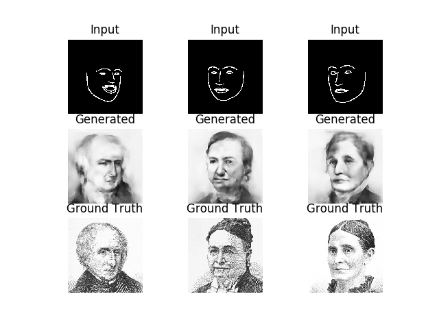

# edges2portrait

Edges to portrait image-to-image translation using MUNIT

Inspired from [Mario Klingemann's work](https://twitter.com/quasimondo/status/826065030944870400)

## Dependency
- Python 3
- scikit-image
- numpy
- matplotlib
- keras

## Better Implementation

https://github.com/kairess/MUNIT-Tensorflow